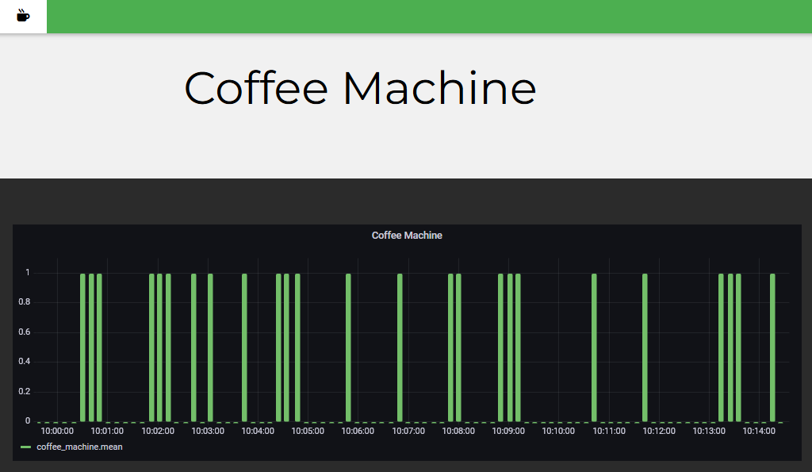

# Coffee Machine

In the decorative art school of Paris, we are almost 1K users for 1 coffee machine. You can imagine the length of the queue each time we want one.

The idea is to monitor the activity of the machine to determine what is the best moment to go downstair.

I choose to only track when the machine take some watter from to avoid privacy issues with cameras of microphones.

So I plug ready-made for sensor with en ESP32. Connected to a InfluxDB install on a Raspberry Pi and connected to a ghost network over all the building.

Then with Grafana i can embed the chart.

The next step will be to train a model to predicte the ideal moment to take the coffee break.




## RaspberryPi

### Setup Wifi wlan0

edit wpa_supplicant.conf to setup wifi.

`sudo nano /etc/network/wpa_supplicant/wpa_supplicant.conf`

```block
country=FR
ctrl_interface=DIR=/var/run/wpa_supplicant GROUP=netdev
ap_scan=1

update_config=1
network={
    scan_ssid=1
    ssid="SSId"
    psk="PASS"
}
```

`ap_scan=1` is mendatory for hidden ssid network. 

### Install Grafana port :3000

[based on Grafana documentation](https://grafana.com/tutorials/install-grafana-on-raspberry-pi/)

**add :**

`wget -q -O - https://packages.grafana.com/gpg.key | sudo apt-key add -`

`echo "deb https://packages.grafana.com/oss/deb stable main" | sudo tee -a /etc/apt/sources.list.d/grafana.list`

**install :**

`sudo apt update && sudo apt install -y grafana`

`sudo systemctl enable grafana-server && sudo systemctl start grafana-server`

**test Grafana UI :**

`http://<ip address>:3000`

### Install InfluxDB port :8086

[based on hackster.io](https://www.hackster.io/kamaluddinkhan/how-to-set-up-influxdb-2-on-a-raspberry-pi-b8ef84)

[Influx documentation](https://docs.influxdata.com/influxdb/v2.6/install/)

**add :**

`wget -qO- https://repos.influxdata.com/influxdb.key | gpg --dearmor | sudo tee /etc/apt/trusted.gpg.d/influxdb.gpg > /dev/null`

`export DISTRIB_ID=$(lsb_release -si); export DISTRIB_CODENAME=$(lsb_release -sc)`

`echo "deb [signed-by=/etc/apt/trusted.gpg.d/influxdb.gpg] https://repos.influxdata.com/${DISTRIB_ID,,} ${DISTRIB_CODENAME} stable" | sudo tee /etc/apt/sources.list.d/influxdb.list > /dev/null`

**install :**

`sudo apt update && sudo apt install influxdb2 influxdb2-cli -y`

`sudo systemctl enable influxdb && sudo systemctl start influxdb`

**test Influx UI:**

`http://<ip address>:8086`

### Add Influx in Grafana Data Source

connect to Grafana UI in a web browser :

⚙️→ Data Sources → Add data source → "InfluxDB"
IDENTIFIER &emsp;|&emsp;VALUE|
--|--|
name |what you want|
language        |InfluxQL                           |
URL             |http://< ipaddress >:8086          |
Basic auth ✅   | with credentials ✅              |
User            |  go to influxdb → About → User ID |
Password        | Password of this user             |
HTTP Headers    | Add new|
Header          | `Authorization`                   |
Value           | should be similar as : `Token Wh_a6EjGQvkwvTaAeVE7qq                         AAvhYo4Z491ai25gtjjKoX_CV99zZ_zyBObn9SHKxaBwrPsfHRwCdos5tBAtgPu6g==`      |
Database        | < name of bucket >                |
User            | go to influxdb → About → User ID  |
Password        | Password of this user             |
HTTP Methode    | `GET`                             |

### Embedded Grafana on Web Page

**Setup Grafana :**

allow anonymous connection

`sudo nano /etc/grafana/grafana.ini --line`

L.300 → `allow_embedding = true`

L.477 →
```
[auth.anonymous]
enabled = true

org_name = < you org >

org_role = Viewer
```

## ESP

[link here](https://randomnerdtutorials.com/esp8266-nodemcu-influxdb/)

`http://<ip address>:8086` Data → Sources → Arduino

`http://<ip address>:8086` Data → API Tokens `VmKT8a91HltXeKR5LTSQdfSI9NneqmHc8fsGKqZRkTuYTMXQI8wAFLB1z7iBYp-JnAn1NIi6ZJCdPDnSEbwr7w==`
